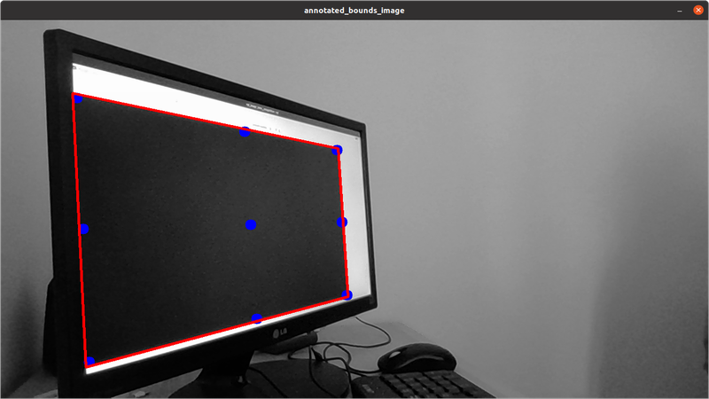
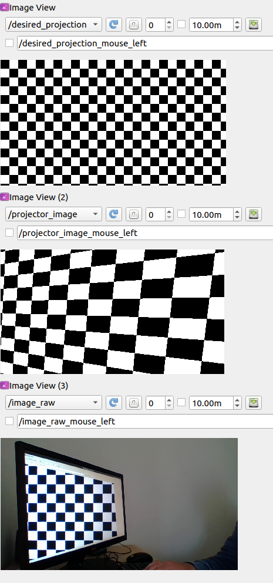

# Camera-Projector Alignment

ROS2 package for projecting images aligned with a given camera frame.

Envisaged application - projecting image annotations (segmentations, bounding boxes etc) back onto the real world.

## Current State

Have developed a calibration node to determine the homography between a projected image plane and the image plane of a camera. Tested using a computer monitor rather than an actual projector:



**Figure:** projection plane (red outline) as detected in image. Blue points are used to compute homography.

Further, have developed a node to receive desired projection patterns (specified in camera frame) and send images to the projector, with required warping to account for camera->projector homography.



**Figure**: Top: the image I'd like to project on the world, defined in the camera frame. Middle: the image to send to the projector in order to achieve this (accounts for perspective warping). Bottom: projection as seen by the camera. 

## Limitations

* This homography-based approach will only produce well-aligned projections for object lying close to the projector plane (or where this plane was during calibraion). Alignment for projection at varying object-depths likely requires some form of 3D sensing.


## Next Steps
 * Test with an actual projector
 * Try projecting the output of some person detection or segmentation algorithm
 * Try rqt-image-overlay for comparing desired projection and actual result as seen by the camera
    -  https://rqt-image-overlay.readthedocs.io/en/latest/installation.html
    - (requires ros2 galactic)
 *  Handle case where projector image is not fully contained within camera image
    - will require recognising when point detection has failed in calibration
    - potentially handled somewhat by RANSAC, could also increase number of points sampled
* Consider some form of 3D sensing for producing well-aligned projections at various object depths

## Usage

### Build

This is an `ament_python` package, buildable as usual in a colcon workspace (tested on ROS2 Foxy).

I'm currently also building https://github.com/Kapernikov/cv_camera.git in my workspace, as the cv_camera package has not been released in Foxy.

### Calibrate

1) Start the 'projector'. For me this was a computer monitor with `rqt_image_view` running, subscribed to topic `/projector_image`.

1) Start the camera driver:
    ```bash
    ros2 run cv_camera cv_camera_node --ros-args -r image_raw:=camera_image
    ```
    Ensure the camera can see the entire image from the projector.
1) Run the calibration node:
    ```bash
    ros2 run camera_projector_alignment calibration
    ```
    A series of dots will be projected, then the final calibration result will be shown for sanity checking purposes. The calibration result will be written to `/tmp/`. (TODO better handling of calibration files).

### Run

To run the main projection node:

```bash
ros2 run camera_projector_alignment projector_align
```
This will listen for images on topic `/desired_projection` and transform and publish them as necessary. 

For test purposes a grid pattern can be projected:
```bash
ros2 run camera_projector_alignment project_grid
```

With this running you should be able to see a well aligned grid in the camera feed, regardless of camera/projector perspective differences.

### Test

Run the calibration node with the projector output fed directly back as camera input. This should produce an identity homography matrix:

```bash
ros2 run camera_projector_alignment calibration --ros-args -r camera_image:=projector_image
```

Expected output:
```text
homography:
[[ 1.  0. -0.]
 [-0.  1.  0.]
 [-0.  0.  1.]]
```
